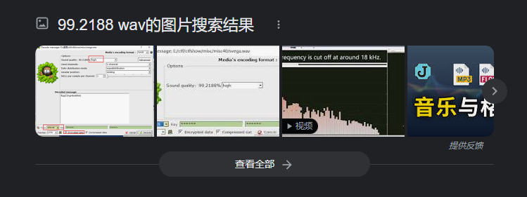

# 卡比的请求

## 题面

天狗兴冲冲地预购了他最喜欢的 3D 动作游戏，但他收到快递把卡带往 Switch 里一塞的时候却弹出了一个神秘的文件。你能帮帮他吗？

* 可选提示 1：卡比好像能通过音频把它想画出来的东西传递给你？
* 可选提示 2：卡比画出来的东西好像背景没有那么白……为什么呢？
* 可选提示 3：`99.2188 wav`
* 可选提示 4：尝试解密的时候记得去掉本来不应在里面存在的东西

## 分发的文件

`help_me.wav`

## 文件结构

`20230504_165915.wav` 是原来生成的 SSTV (ROBOT 72)

`car_original.jpg` 是汽车塞满嘴

`car.jpg` 是 `flag`

`car_{1-5}.jpg` 是 OpenSSL 按照把卡比文翻译以后的五行数字去 map 到 five rounds of aes-256-cbc 加密的结果。

`flag.jpg` 是 `car_5.jpg` 加上提示的产物。

`help_me.wav` 是使用 `SlientEye` 隐写前述音频的产物。

## 解题




```bash
> strings ./flag.jpg
...
five rounds of aes-256-cbc ; the pass is within the signal
```

`tjctf{kIRBy_$_L@n9ua9#}`