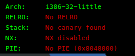
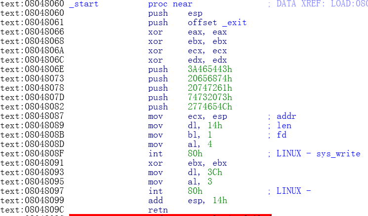

# 天狗的 shellcode

## 题目描述

*Challenge and description by MiaoTony.*

天狗说这是个简单题，随便分析一下就能出，写写 shellcode 就好。


## 程序环境与保护方式

```
# file pwn
pwn: ELF 32-bit LSB executable, Intel 80386, version 1 (SYSV), statically linked, not stripped

# checksec pwn
    Arch:     i386-32-little
    RELRO:    No RELRO
    Stack:    No canary found
    NX:       NX disabled
    PIE:      No PIE (0x8048000)
```

## 考点

shellcode


## 题目解析

1. 检查程序保护方式.

    

2. read调用(mov al,3;int 80;)存在栈溢出,返回地址偏移为0x14.

    

3. 返回地址后即为之前push的esp，返回地址溢出为0x8048087再次打印栈内容leak出esp，再次栈溢出跳到栈上执行shellcode. 
    利用80h中断中的sys_execve：`\x31\xc9\xf7\xe1\x51\x68\x2f\x2f\x73\x68\x68\x2f\x62\x69\x6e\x89\xe3\xb0\x0b\xcd\x80`.

脚本参考: [exp.py](./exp.py)
