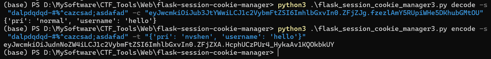
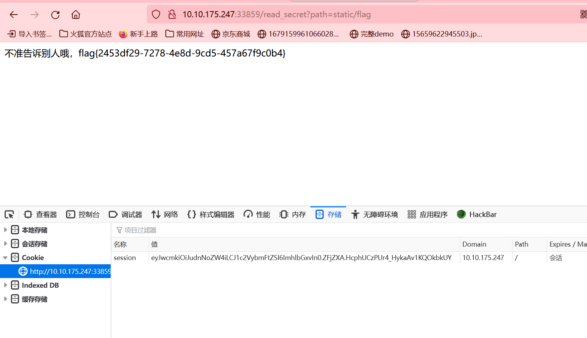

# 天狗的秘密

## 解一：

发现flag在静态资源文件夹

直接访问路由获得flag

http://ip:port/static/flag

## 解二：

伪造session获取flag

首先读取app.py获取密钥

http://ip:port/read_secret?path=app.py

http://ip:port/read_secret?path=/proc/self/cwd/app.py

拿到密钥之后利用脚本（https://github.com/noraj/flask-session-cookie-manager）伪造flask session

利用这个session去访问获取flag文件即可

